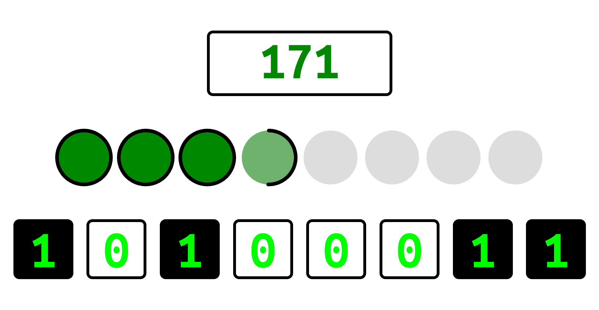

# Binary Game

## Learn to translate decimal notation to binary..quickly!!

### [Vai al gioco](https://gmarabelli.github.io/binary-game)

Questo semplice gioco metterà alla prova le tue abilità di conversione dal sistema decimale al sistema binario.

Ogni round viene selezionato un numero casuale, che verrà scritto in decimale nel riquadro in alto. L'obiettivo del round è comporre la sua traduzione binaria con i bit che si trovano in basso prima che il tempo scada. Con lo scorrere del tempo si riducono i punti timer e se si esauriscono perderai un bit e scenderai di livello. Convertendo i numeri in binario, invece, puoi guadagnare punti timer fino a salire di livello, guadagnando un nuovo bit e rendendo più avvincente la sfida!

Buon divertimento!
